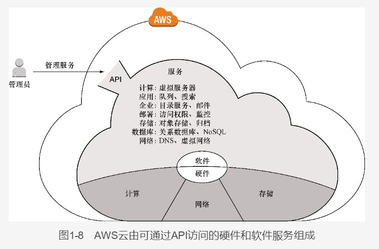

# 探索AWS服务
什么是AWS服务呢？为什么AWS能提供给我们这么多服务呢？如何使用这些服务呢？

## 理解AWS服务机制

从上图中可以看出，用于计算、存储和联网的硬件是AWS云计算的基础。AWS在硬件上运行软件来提供云服务。

WEB界面、API充当AWS服务和应用程序之间的接口。客户可以通过图形用户界面，使用SDK以编程的方式手动发送请求至API，以实现对服务的管理。为此，客户可以使用诸如管理控制台，基于WEB的用户界面或命令行工具等工具。

虚拟服务器有其特殊性，例如，客户可以通过SSH连接到虚拟服务器，并获得管理员访问权限。这意味着客户可以在虚拟服务器上安装所需要的任何软件。其他服务，如NoSQL数据库则是通过API提供其功能，细节被隐藏到幕后。

## AWS服务的分类
下面对AWS服务的分类将有助于客户找到所需要的服务：
1. 计算服务。提供了计算能力以及内存。客户可以启动虚拟服务器并使用他们来运行应用程序。
2. 应用服务。为常见的使用场景提供解决方案，如消息队列，主题以及检索大量数据以集成到应用中。
3. 企业服务。提供独立的解决方案，如邮件服务器和目录服务。
4. 部署和管理服务。作用于迄今所提到的服务。这个服务可以帮助客户授予或者撤销对云资源的访问、虚拟服务系统的监控以及部署应用程序。
5. 存储服务。被用来搜集、保存和归档数据。AWS提供了不同的存储选项：对象存储或者用于虚拟服务器的网络附件存储方案。
6. 数据库存储。当需要结构化数据时，数据库存储比其他存储方案有一些优势。AWS提供了关系数据库和NoSQL数据库服务。
7. 网络服务。客户可以定义一个私有的网络并使用高度集成的DNS服务。

## 总结
AWS就是提供了各种服务的工具。通过API可以实现对这些服务的管理。
