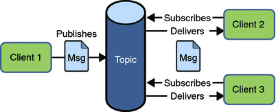

# JMS
## 前言
Kafka是一种分布式的消息中间件。因此在学习Kafka之前，我们需要先来了解什么消息服务以及消息中间件。

## 一、什么是JMS
JMS即Java Message Service,Java消息服务应用程序接口，是一个Java平台中关于面向消息中间件（MOM）的API，用于在两个应用程序之间，或分布式系统中发送消息，进行异步通信。Java消息服务是一个与具体平台无关的API，绝大多数MOM提供商都对JMS提供支持。我们可以简单理解：两个应用程序之间需要通信，我们使用一个JMS服务，进行中间的转发，通过JMS的使用，我们可以解除两个程序之间的耦合。

## 二、JMS的优势
1. Asynchronous（异步）

JMS is asynchronous by default. So to receive a message, the client is not required to send the request. The message will arrive automatically to the client as they become available.（JMS 原本就是一个异步的消息服务，客户端获取消息的时候，不需要主动发送请求，消息会自动发送给可用的客户端）

2. Reliable（可靠）

JMS provides the facility of assurance that the message will delivered once and only once. You know that duplicate messages create problems. JMS helps you avoiding such problems.（JMS保证消息只会递送一次。大家都遇到过重复创建消息问题，而JMS能帮你避免该问题。）
## 三、JMS的消息模式
JMS具有两种通信模式：
* Point-to-Point Messaging Domain （点对点）
* Publish/Subscribe Messaging Domain （发布/订阅模式）

### Point-to-Point Messaging Domain（点对点通信模型）
1. 模式图

2. 概念：在点对点通信模式中，应用程序由消息队列、发送方、接受方组成。每个消息都被发送到一个特定的队列，接收者从队列中获取消息。队列保留着消息，直到他们被消费或超时。

3. 特点
  * 每个消息只要一个消费者
  * 发送者和接受者在时间上是没有约束，也就是说发送者在发送完消息之后，不管接收者有没有接受消息，都不影响发送方发送消息到消息队列中。
  * 发送方不管是否在发送消息，接受方都可以从消息队列中取到消息。
  * 接受方在接受完消息之后，需要向消息队列应答成功。

### Publish/Subscribe Messaging Domain（发布/订阅通信模型）
1. 模式图

2. 概念：在发布/订阅消息模式中，发布者发布一个消息，该消息通过topic传递给所有的客户端。该模式下，发布者与订阅者都是匿名的，即发布者与订阅者都不知道对方是谁。并且可以动态的发布与订阅Topic。Topic主要用于保存和传递消息，且会一直保存消息直到被传递给客户端。

3. 特点：
  * 一个消息可以传递给多个订阅者（即：一个消息可以有多个接受方）
  * 发布者与订阅者具有时间约束，针对某个主题（Topic）的订阅者，它必须创建一个订阅者之后，才能消费发布者的消息，而且为了消费消息，订阅者必须保持运行的状态。
  * 为了缓和这样严格的时间相关性，JMS允许订阅者创建一个可持久化的订阅。这样，即使订阅者没有被激活（运行），它也能接收到发布者的消息。

## 四、JMS接受消息
在JMS中，消息的产生和消费是异步的。对于消费来说，JMS的消息者可以通过两种方式来消费消息。
1. 同步（Synchronous）

在同步消费信息模式中，订阅者/接受方通过调用receive()方法来接受消息。在receive()方法中，线程会阻塞直到消息到达或者指定时间后消息仍未到达。

2. 异步（Asynchronous）

使用异步方式接收消息的话，消息订阅者需注册一个消息监听者，类似于事件监听器，只要消息到达，JMS服务提供者会通过调用监听器的onMessage()传递消息。
