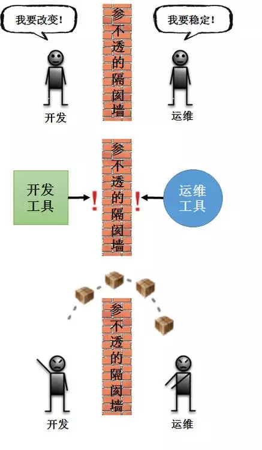
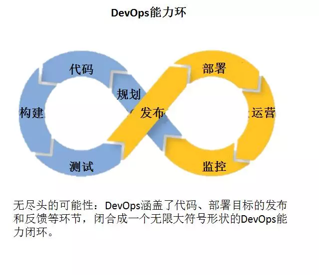

# DevOps

## 传统开发与维护的隔阂

## 一、DevOps的概念
DevOps一词来源于Development和Operations的组合，突出重视软件开发人员和运维人员的沟通合作，通过自动化流程来使得软件构建、测试、发布更加快捷、频繁和可靠。

DevOps是为了填补开发端和运维端之间的信息鸿沟，改善团队之间的协作关系。不过需要澄清的一点是，从开发到运维，中间还有测试环节。DevOps其实包含了三个部分：开发、测试和运维。

 换句话说，DevOps希望做到的是软件产品交付过程中IT工具链的打通，使得各个团队减少时间损耗，更加高效地协同工作。专家们总结出了下面这个DevOps能力图，良好的闭环可以大大增加整体的产出。

## 二、实现DevOps需要什么？
### 硬件要求：工具上的准备
1. 代码管理（SCM）：GitHub、GitLab、BitBucket、SubVersion
2. 构建工具：Ant、Gradle、maven
3. 自动部署：Capistrano、CodeDeploy
4. 持续集成（CI）：Bamboo、Hudson、Jenkins
5. 配置管理：Ansible、Chef、Puppet、SaltStack、ScriptRock GuardRail
6. 容器：Docker、LXC、第三方厂商如AWS
7. 编排：Kubernetes、Core、Apache Mesos、DC/OS
8. 服务注册与发现：Zookeeper、etcd、Consul
9. 脚本语言：python、ruby、shell
10. 日志管理：ELK、Logentries
11. 系统监控：Datadog、Graphite、Icinga、Nagios
12. 性能监控：AppDynamics、New Relic、Splunk
13. 压力测试：JMeter、Blaze Meter、loader.io
14. 预警：PagerDuty、pingdom、厂商自带如AWS SNS
15. HTTP加速器：Varnish
16. 消息队列：ActiveMQ、SQS
17. 应用服务器：Tomcat、JBoss
18. Web服务器：Apache、Nginx、IIS
19. 数据库：MySQL、Oracle、PostgreSQL等关系型数据库；cassandra、mongoDB、redis等NoSQL数据库
20. 项目管理：Jira、Asana、Taiga、Trello、Basecamp、Pivotal Tracker

### 软件需求：文化和人
DevOps成功与否，公司组织是否利于协作是关键。开发人员和运维人员可以良好沟通互相学习，从而拥有高生产力。并且协作也存在于业务人员与开发人员之间。

## 三、DevOps带来的好处
### 1.DevOps的一个巨大好处就是可以高效交付，这也正好是它的初衷。
### 2.DevOps另外一个好处就是会改善公司组织文化、提高员工的参与感。
### 3.快速部署同时提高IT稳定性。
