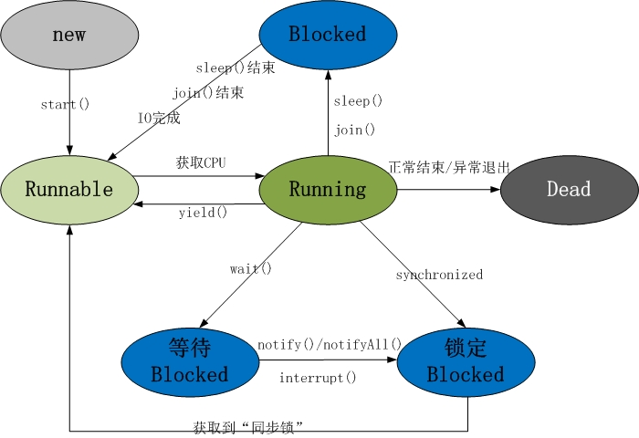

# 线程的生命周期及五种基本状态

先来看一张图，然后结合图来讲解：

## 线程的生命周期及五种基本状态

Java线程具有五种基本状态：
1. 新建状态（New）：当线程对象创建后，即进入了新建状态，如：Thread t=new MyThread();

2. 就绪状态（Runnable）：当调用线程对象的start()方法（t.start();）,线程即进入就绪状态。处于就绪状态的线程，只是说明此线程已经做好了准备，随时等待CPU调度执行，并不是说执行了t.start()此线程立即就会执行。

3. 运行状态（Running）：当CPU开始调度处于就绪状态的线程时，此时线程才得以真正执行，即进入运行状态。注：就绪状态是进入到运行状态的唯一入口，也就是说，线程要想进入运行状态执行，首先必须处于就绪状态中。

4. 阻塞状态（Blocked）：处于运行状态中的线程由于某种原因，暂时放弃对CPU的使用权，停止执行，此时进入阻塞状态，直到其进入到就绪状态，才有机会再次被CPU调用以进入到运行状态。根据阻塞产生的原因不同，阻塞状态又可以分为三种：
  * 等待阻塞：运行状态中的线程执行wait()方法，使本县城进入到等待阻塞状态；
  * 同步阻塞：线程如果获取synchronized同步锁失败（因为锁被其他线程所占用），它会进入同步阻塞状态；
  * 其他阻塞：通过调用线程的sleep()或join()或发出了I/O请求时，线程会进入到阻塞状态。当sleep()状态超时、join()等待线程终止或者超时、或者I/O处理完毕时，线程重新转入就绪状态。

5. 死亡状态（Dead）:线程执行完了或者因异常退出了run()方法，该线程结束生命周期。

## Java多线程的就绪、运行和死亡状态

1. 就绪状态转换为运行状态：当此线程得到处理器资源；
2. 运行状态转换为就绪状态：当此线程主动调用yield()方法或运行过程中失去处理器资源。
3. 运行状态转换为死亡状态：当此线程执行完毕或发生了异常。

此处需要特别注意的是：当调用线程的yield()方法时，线程从运行状态转换为就绪状态，但接下来CPU调度就绪状态中的哪个线程具有一定的随机性，因此，可能会出现A线程调用了yield()方法后，接下来CPU仍然调度了A线程的情况。
