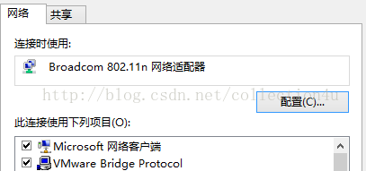

# VMWare虚拟机的网络模式及配置

## 虚拟机的三种网络模式

VMware虚拟机有三种网络模式，分别是Bridged(桥接模式)、NAT(网络地址转换模式)、Host-only(主机模式)。

VMWare workstation安装之后会多出三个网络连接，分别是VMware Network Adapter VMnet1,VMware Network Adapter VMnet8和VMnet0。这三个虚拟网络都是WMware安装好之后自动生成的，不需要手动修改。其中VMnet0用于Bridged模式，VMnet1用于Host-only模式，Vmnet8用于NAT模式。VMnet8和VMnet1提供DHCP服务，VMnet0默认则不提供。


## Bridged(桥接模式)

在这种模式下，VMWare虚拟出来的操作系统就像局域网中的一台独立的主机，它可以访问网内任何一台机器，你需要手工为虚拟系统配置IP地址、子网掩码，而且还要和宿主机器处于同一网段，这样虚拟系统才能和宿主机器进行通信，虚拟系统和宿主机器的关系，就像连接在同一个Hub上的两台电脑。从网络技术上理解相当于在宿主机前端加设了一个虚拟交换机，然后宿主机和所有虚拟机共享这个交换机。

`如果想利用VMWare在局域网内新建一个虚拟服务器，为局域网用户提供网络服务，就应该选择桥接模式`

### 桥接模式下的网络设置
  1. 检查本地网络链接属性中的VMwareBridge Protocol选项是否勾选，默认安装好VMware后是自动勾选的，如下图：

  

  2. 虚拟机网络设置为桥接：

  

  3. 在Windows宿主机器查看网络参数，输入ipconfig:

  

  4. 进入虚拟机上的Linux系统，修改网络配置文件。CentOS7以前的版本，网卡配置文件是/etc/sysconfig/network-scripts/ifcfg-eth0，而7以后的版本则是ens33。这里以ens33为例：
  ```
  $cd /etc/sysconfig/network-scripts/
  $vim fcfg-eno16777736  ##编辑配置文件，修改以下内容：
  BOOTPROTO="static"
  ONBOOT="yes"
  IPADDR=192.168.43.206    //IP必须与主机的ip段的网关相对应
  GATEWAY=192.168.43.1      //网关必须与主机的网关一致

  //配置文件修改完成以后，重启网络
  $systemctl restart network.service
  ```
  5. 以上配置后，一般情况下主机和虚拟机之间就能够通讯了，配置好DNS的话，虚拟机也可以访问外网。如果出现主机不能Ping通虚拟机的情况，可以查看主机的防火墙的入站规则中对ICMP协议相关的配置文件是否启用。
